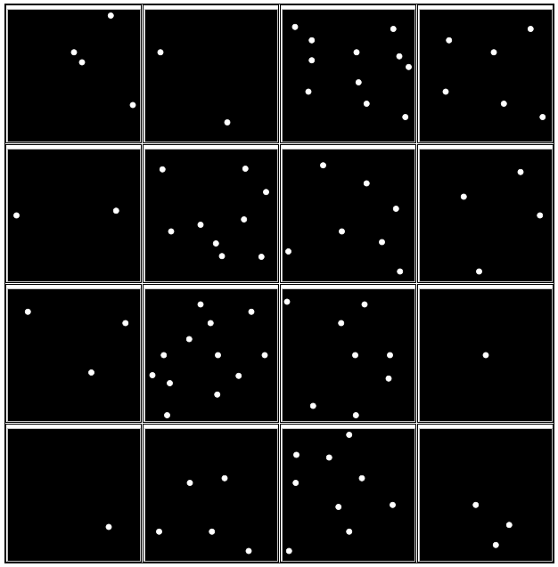
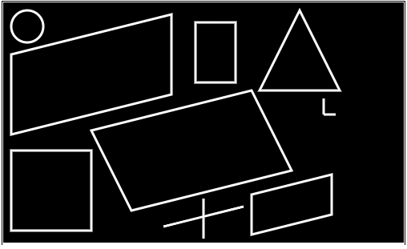
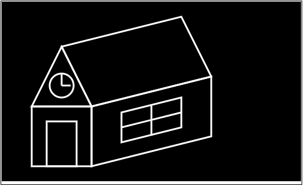

# Complejidad

Un Sistema es un conjunto de componentes interactuando o interdependientes formando un todo integrado. Cada sistema está delimitado por sus límites espacio/temporales e influenciado por su entorno, descrito por su estructura y propósito y expresado en su funcionamiento

> Un Sistema Complejo es aquel cuya complejida excede la capacidad intelectual humana — Grady Booch

    

## Sistema de elementos

#### Sistema de puntos

¿Cúantos elementos hay en cada imagen de arriba a abajo y de izqiuerda a derecha sin fallar, sin prisas y sé consciente sobre cuándo los cuentas (siguiendo uno por uno con "golpes" de vista) o cuándo los ves (sin seguimiento, con un solo golpe de vista)

La media en las personas es que hasta 4 elementos se ven y a partir de 5 se cuentan.

    

### Sistema con figuras

Mira el dibujo durante 5 segundos para memorizarlo y repetirlo con lápiz y papel

    

Mira el dibujo durante 5 segundos para memorizarlo y repetirlo con lápiz y papel

Número Mágico de Miller: el número de objetos que una persona promedio puede tener en la memoria de trabajo es 7 ± 2.

## Características de Sistemas Complejos

 - Estructura jerárquica: frecuentemente, la complejidad adquiere una forma jerárquica donde el sistema complejo está compuesto de subsistemas interrelacionados que a su vez tienen sus propios subsistemas y así hasta que se alcanza algún elemento del más bajo nivel. No solo son sistemas complejos jerárquicos sino que los niveles de su jerarquía representan los diferentes niveles de abstracción cada uno construido sobre otro y cada uno comprensible por sí mismo.
 
 - Patrones comunes: los sistemas jerárquicos se componen generalmente de sólo unos pocos tipos diferentes de subsistemas en varias combinaciones y órdenes. Nos encontramos con una gran similitud en la forma de mecanismos compartidos unificando esta vasta jerarquía.
 
 - Separación de asuntos: hay una clara separación de asuntos entre las partes de diferentes niveles de abstracción.

## Capacidades cualitativas

La historia del ser humano disfruta de cuatro mecanismos mentales que facilitan enormemente nuestra comprensión de los sistemas complejos:

#### Abstracción
Es el proceso de extracción de las características esenciales de algo (lo que queremos modelar), ignorando los detalles superficiales. 
Diferentes posibles abstracciones para un coche:

| Alquilado  | Particular | Flete    |
|------------|------------|----------|
| Tarifa     | Consumo          | Consumo   |
| Limite kms | Color            | Carga soportada   |
| Consumo    | Valor de reventa | Garantía   |
|            | Durabilidad      |            |

#### Encapsulación
Es el proceso en el cual se ocultan los detalles del soporte de las características de una
abstracción. 
No se trata de ocultar las características en sí, sino de no mostrar cómo guardo o maneja
internamente esas características. 
Por ej, de la clase fecha nos interesa obtener el día, mes y año. Y no como esta guardado internamente.

#### Modularización
Es el proceso de descomposición de un sistema en un conjunto de módulos o piezas.
Que esten poco acopladas (independientes) y cohesivas (con significado propio). 
Se entiende por sistema al conjunto de piezas que colaboran entre sí.
Por ej, el módulo de cierre centralizado con el módulo de la alarma del auto.

#### Jerarquización
Es el proceso de estructuración por el que se produce una organización de un conjunto de
elementos en niveles de responsabilidad. 

> Nuestra experiencia es que los sistemas de software complejos más exitosos son aquellos cuyos diseños incluyen explícitamente las estructuras de clases y objetos bien diseñados y encarnan los cinco atributos de sistemas complejos descritos en la sección anterior. […] Muy raramente nos encontramos con sistemas de software que se entregan a tiempo, que están dentro del presupuesto y que cumplen con sus requisitos, a menos que estén diseñados con estos factores en mente
— Grady Booch

## Síntesis

## Tamaño

En los primeros años del software (80') se acordaba que la cantidad de lineas de una función no debería superar el alto del monitor. En ese entonces los monitores eran de baja resolución y entraban unas pocas líneas. Con los monitores de hoy, podemos ver mas de 50 líneas sin necesidad de scrollear.
No hay una afirmación concreta de porqué las funciones deben ser pequeñas
### Haz una cosa
### Argumentos
### Efecto lateral
### Arrojar Excepciones en lugar de código de error

